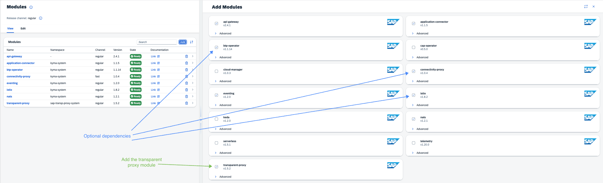

<!-- loio1700cfe070704d2e80aa76de1033a6c4 -->

# Transparent Proxy in the Kyma Environment

Use the transparent proxy in the Kyma environment.

This documentation serves as a reference for the transparent proxy installation in Kyma environment and the respective [Transparent Proxy Operator](transparent-proxy-operator-2d826aa.md).

<a name="loio1700cfe070704d2e80aa76de1033a6c4__section_tpm_wxc_zxb"/>

## Add the Transparent Proxy Module

To add the transparent proxy module, refer to [Add and Delete a Kyma Module](https://help.sap.com/docs/btp/sap-business-technology-platform/enable-and-disable-kyma-module?version=Cloud#loio1b548e9ad4744b978b8b595288b0cb5c).

Navigate to the module management form and opt-in for the transparent proxy module.

> ### Caution:  
> The **sap-transp-proxy-system** namespace is intended for the monitoring of the transparent proxy resources, do not use it for deploying workloads there.

> ### Caution:  
> All resources created in **sap-transp-proxy-system** will be deleted \(and also the namespace\) with the deletion of the transparent proxy itself - this includes the default Destination service instance and the transparent proxy module created initially.

Once the module is successfully added, a transparent proxy custom resource gets created in the "sap-transp-proxy-system" namespace. You can modify this resource to suit your requirements. For more information, check transparent proxy custom resource section here: [Installation with Operator](installation-with-operator-8f5dd89.md).

<a name="loio1700cfe070704d2e80aa76de1033a6c4__section_zk4_4gm_zyb"/>

## Dependencies

The optional dependencies automate the installation and configuration of the transparent proxy:

-   With the BTP Operator in place, the transparent proxy will create a Destination service instance in your Kyma cluster and link itself to it.

-   Istio will encrypt the traffic between the workloads, making your Kyma instance more secure. The communication with the transparent proxy will be secure, as well as the communication from the transparent proxy to the connectivity proxy, if a connectivity proxy is present in the Kyma instance.

-   The connectivity proxy becomes mandatory if you want to consume an on-premise system.

For more comprehensive information about the transparent proxy dependencies, see [Transparent Proxy Operator](transparent-proxy-operator-2d826aa.md).

<a name="loio1700cfe070704d2e80aa76de1033a6c4__section_wzh_2kf_3cc"/>

## Connectivity Proxy and On-Premise Connectivity

If you want to connect to an on-premise system, you will need the connectivity proxy module added in your Kyma instance. The transparent proxy will automatically connect with the connectivity proxy if the connectivity proxy module is added. If you choose to manually link to a connectivity proxy, the automatic connection will not override your configuration.

<a name="loio1700cfe070704d2e80aa76de1033a6c4__TransparentProxyinKymaenvironment-Encryptionbetweenmicro-components"/>

## Troubleshooting

In case of issues, please refer to [Transparent Proxy Custom Resource Conditions](transparent-proxy-custom-resource-conditions-d75e31e.md).

