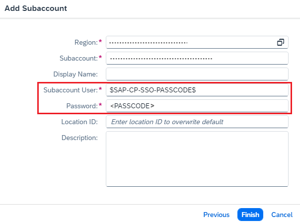
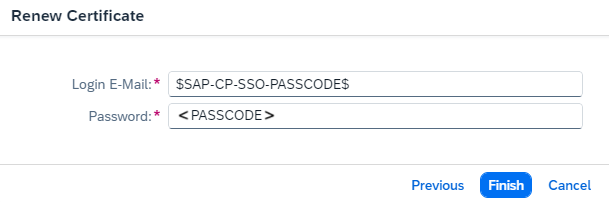

<!-- loio202261235a204db5ba0b35bbaa6d40ff -->

# Use a Custom IDP for Subaccount Configuration

Enable custom identity provider \(IDP\) authentication to configure a Multi-Cloud subaccount in the Cloud Connector by using a one-time passcode.

<a name="loio202261235a204db5ba0b35bbaa6d40ff__content"/>

## Content

[Context](use-a-custom-idp-for-subaccount-configuration-2022612.md#loio202261235a204db5ba0b35bbaa6d40ff__context)

[Get the URL](use-a-custom-idp-for-subaccount-configuration-2022612.md#loio202261235a204db5ba0b35bbaa6d40ff__fsb)

[Get the One-Time Passcode](use-a-custom-idp-for-subaccount-configuration-2022612.md#loio202261235a204db5ba0b35bbaa6d40ff__pass)

<a name="loio202261235a204db5ba0b35bbaa6d40ff__context"/>

## Context

For a subaccount in the **Multi-Cloud** environment that uses a custom IDP, you can choose this IDP for authentication instead of the \(default\) SAP ID service when configuring the subaccount in the Cloud Connector.

Using custom IDP authentication, you can perform the following operations in the Cloud Connector:

<table>
<tr>
<th valign="top">

Operation

</th>
<th valign="top">

Description

</th>
</tr>
<tr>
<td valign="top">

[Adding and Managing Subaccounts](adding-and-managing-subaccounts-f16df12.md)

</td>
<td valign="top">

Add a subaccount to a Cloud Connector installation.

</td>
</tr>
<tr>
<td valign="top">

[Renew the Certificate for a Subaccount](renew-the-certificate-for-a-subaccount-071708a.md)

</td>
<td valign="top">

Refresh a subaccount certificate's validity period.

</td>
</tr>
</table>

To enable custom IDP authentication, for each of these operations you must enter the marker value `$SAP-CP-SSO-PASSCODE$` in the *<Subaccount User\>* or *<User Name\>* field, and a one-time generated passcode \(known as *temporary authentication code*\) in the *<Password\>* field:

-   When adding a subaccount to a Cloud Connector installation, enter the user name `$SAP-CP-SSO-PASSCODE$` and the passcode on the Cloud Connector's *Add Subaccount* screen:

    

-   To **refresh a subaccount certificate**, enter the user name `$SAP-CP-SSO-PASSCODE$` and the passcode via the corresponding *<Subaccount\>* screen \(see also [Renew the Certificate for a Subaccount](renew-the-certificate-for-a-subaccount-071708a.md)\):

    

To retrieve the one-time generated passcode, you must use the correct login URL for single sign-on \(SSO\) to access your custom IDP.

> ### Tip:  
> As of Cloud Connector version 2.17, you can import subaccount authentication data to simplify the process when using custom IdPs. Instead of using the SSO passcode approach, we strongly recommend that you import an authentication data file.
> 
> For more information, see [Adding and Managing Subaccounts](adding-and-managing-subaccounts-f16df12.md).

> ### Caution:  
> Mind the required user rights described in the prerequisites for [Initial Configuration](initial-configuration-db9170a.md#loiodb9170a7d97610148537d5a84bf79ba2__prereq) and [Adding and Managing Subaccounts](adding-and-managing-subaccounts-f16df12.md).

Back to [Content](use-a-custom-idp-for-subaccount-configuration-2022612.md#loio202261235a204db5ba0b35bbaa6d40ff__content)

<a name="loio202261235a204db5ba0b35bbaa6d40ff__fsb"/>

## Get the URL

Choose one of the following options:

**Option 1: Assemble the URL**

The URL pattern is *https://<subdomain\>.authentication.<btp-XSUAA-host\>/passcode*.

1.  Get the SAP BTP region host, for example, *eu10.hana.ondemand.com*.
2.  Assemble the final URL to be used, in this case: *https://mysubdomain.authentication.eu10.hana.ondemand.com/passcode*.

**Option 2: Get the URL Using the Connectivity Service Instance Credentials**

1.  Choose one of these steps to obtain the URL:
    -   [Create and Bind a Connectivity Service Instance](create-and-bind-a-connectivity-service-instance-a2b88cf.md) 

    -   [Create a service key](https://docs.cloudfoundry.org/devguide/services/service-keys.html)

2.  Get the value of the `token_service_url` attribute.
3.  Append `/passcode` at the end of the obtained URL.

**Next Step** 

[Get the One-Time Passcode](use-a-custom-idp-for-subaccount-configuration-2022612.md#loio202261235a204db5ba0b35bbaa6d40ff__pass)

Back to [Content](use-a-custom-idp-for-subaccount-configuration-2022612.md#loio202261235a204db5ba0b35bbaa6d40ff__content)

<a name="loio202261235a204db5ba0b35bbaa6d40ff__pass"/>

## Get the One-Time Passcode

1.  Open the resulting URL in your browser to get the one-time passcode via SSO:
    -   If *there is* an active user session, the passcode is generated automatically and returned right away.

    -   If there is *no* active user session, you are asked to log on to the IDP manually. If several IDPs are configured, you can choose one from the available options.

2.  Use the passcode to proceed with the subaccount configuration in the Cloud Connector UI.

    Back to [Content](use-a-custom-idp-for-subaccount-configuration-2022612.md#loio202261235a204db5ba0b35bbaa6d40ff__content)

