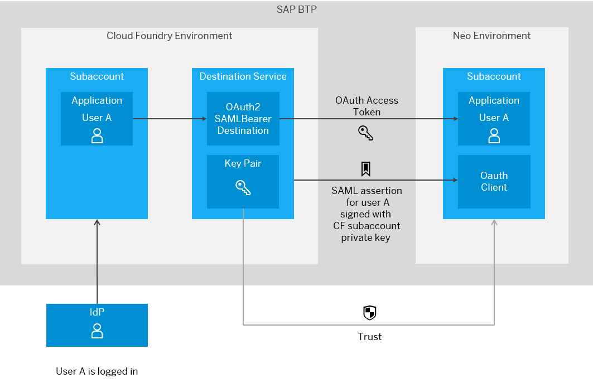
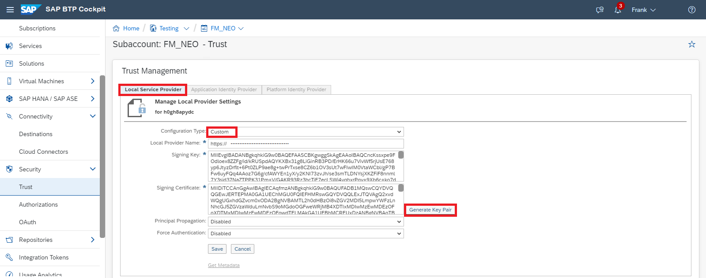
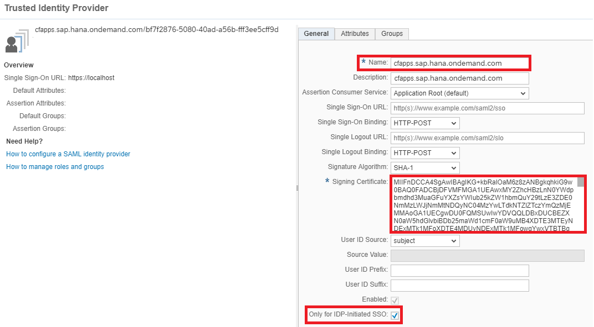
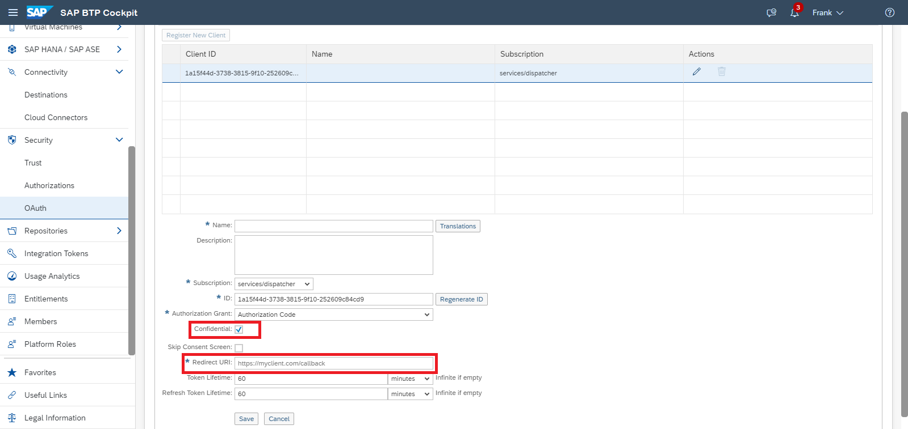
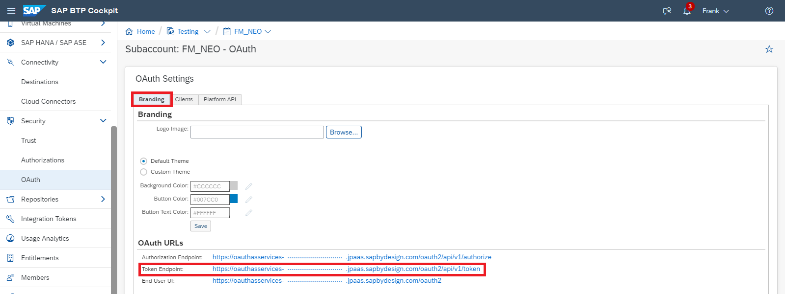
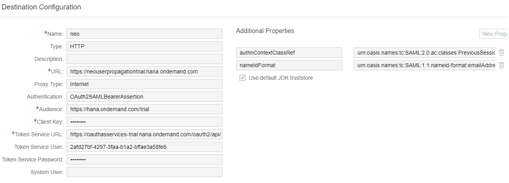

<!-- loio95dde761bb0d4df3acfe9e32e80bb6b7 -->

# User Propagation from the Cloud Foundry Environment to the Neo Environment

Propagate the identity of a user from a Cloud Foundry application to a Neo application.

<a name="loio95dde761bb0d4df3acfe9e32e80bb6b7__steps"/>

## Steps

[Scenario](user-propagation-from-the-cloud-foundry-environment-to-the-neo-environment-95dde76.md#loio95dde761bb0d4df3acfe9e32e80bb6b7__scenario)

[Prerequisites](user-propagation-from-the-cloud-foundry-environment-to-the-neo-environment-95dde76.md#loio95dde761bb0d4df3acfe9e32e80bb6b7__prereq)

[Concept](user-propagation-from-the-cloud-foundry-environment-to-the-neo-environment-95dde76.md#loio95dde761bb0d4df3acfe9e32e80bb6b7__concept)

[Procedure](user-propagation-from-the-cloud-foundry-environment-to-the-neo-environment-95dde76.md#loio95dde761bb0d4df3acfe9e32e80bb6b7__procedure)

1.  [Configure a Local Service Provider for the Neo Subaccount](user-propagation-from-the-cloud-foundry-environment-to-the-neo-environment-95dde76.md#loio95dde761bb0d4df3acfe9e32e80bb6b7__configure)
2.  [Establish Trust between Cloud Foundry and Neo Subaccounts](user-propagation-from-the-cloud-foundry-environment-to-the-neo-environment-95dde76.md#loio95dde761bb0d4df3acfe9e32e80bb6b7__establish)
3.  [Create an OAuth Client for the Neo Application](user-propagation-from-the-cloud-foundry-environment-to-the-neo-environment-95dde76.md#loio95dde761bb0d4df3acfe9e32e80bb6b7__create)
4.  [Create an OAuth2SAMLBearerAssertion Destination for the Cloud Foundry Application](user-propagation-from-the-cloud-foundry-environment-to-the-neo-environment-95dde76.md#loio95dde761bb0d4df3acfe9e32e80bb6b7__oauth)
5.  [Consume the Destination and Execute the Scenario](user-propagation-from-the-cloud-foundry-environment-to-the-neo-environment-95dde76.md#loio95dde761bb0d4df3acfe9e32e80bb6b7__consume)

<a name="loio95dde761bb0d4df3acfe9e32e80bb6b7__scenario"/>

## Scenario

-   You have deployed an application in the Cloud Foundry environment.
-   You want to consume OAuth protected APIs exposed by an application deployed in the Neo environment.
-   You want to propagate the identity of the user logged in to the Cloud Foundry application, to the Neo application.

Back to [Steps](user-propagation-from-the-cloud-foundry-environment-to-the-neo-environment-95dde76.md#loio95dde761bb0d4df3acfe9e32e80bb6b7__steps)

<a name="loio95dde761bb0d4df3acfe9e32e80bb6b7__prereq"/>

## Prerequisites

-   You have deployed an application in the Cloud Foundry environment.
-   You have bound an instance of the Destination Service to the application.
-   You have bound an instance of the XSUAA service with the `application` plan to the application.
-   You have deployed an application in the Neo environment.

Back to [Steps](user-propagation-from-the-cloud-foundry-environment-to-the-neo-environment-95dde76.md#loio95dde761bb0d4df3acfe9e32e80bb6b7__steps)

<a name="loio95dde761bb0d4df3acfe9e32e80bb6b7__concept"/>

## Concept

The identity of a user logged in to the Cloud Foundry application is established by an identity provider \(IdP\).

> ### Note:  
> You can use the default IdP of the Cloud Foundry subaccount or any trusted IdP, for example, the Neo subaccount IdP.

When the application retrieves an OAuthSAMLBearer destination, the user is made available to Cloud Foundry Destination service by means of a *user exchange* JWT \(JSON Web Token\).

The service then wraps the user identity in a SAML assertion, signs it with the Cloud Foundry subaccount private key and sends it to the token endpoint of the OAuth service for the Neo application.

To make the Neo application accept the SAML assertion, you must set up a trust relationship between the Neo subaccount and the Cloud Foundry subaccount public key. You can achieve this by adding the Cloud Foundry subaccount X.509 certificate as trusted IdP in the Neo subaccount. Thus, the Cloud Foundry application starts acting as an IdP and any users propagated by it are accepted by the Neo application, even users that do not exist in the IdP.

The OAuth service accepts the SAML assertion and returns an OAuth access token. In turn, the Destination service returns both the destination and the access token to the requesting application. The application then uses the destination properties and the access token to consume the remote API.

Back to [Steps](user-propagation-from-the-cloud-foundry-environment-to-the-neo-environment-95dde76.md#loio95dde761bb0d4df3acfe9e32e80bb6b7__steps)

<a name="loio95dde761bb0d4df3acfe9e32e80bb6b7__procedure"/>

## Procedure

### Configure a Local Service Provider for the Neo Subaccount 

1.  In the cockpit, navigate to your Neo subaccount, choose *Security* \> *Trust* from the left menu, and go to tab *Local Service Provider* on the right. For *<Configuration Type\>*, select `Custom` and choose *Generate Key Pair*.
2.  *Save* the configuration.

> ### Note:  
> IMPORTANT: When you choose `Custom` for the*Local Service Provider* type, the default IdP \(SAP ID service\) will no longer be available. If your scenario requires login to the SAP ID service as well, you can safely skip this step and leave the default settings for the Local Service Provider.

Back to [Steps](user-propagation-from-the-cloud-foundry-environment-to-the-neo-environment-95dde76.md#loio95dde761bb0d4df3acfe9e32e80bb6b7__steps)

### Establish Trust between Cloud Foundry and Neo Subaccounts

1.  Download the X.509 certificate of the Cloud Foundry subaccount:

    In the cockpit, navigate to your Cloud Foundry subaccount and choose *Connectivity* \> *Destinations*. Press *Download Trust* to get the certificate for this subaccount.

    

2.  Configure trust in the Neo subaccount:

    In the cockpit, navigate to your Neo subaccount, choose *Trust* from the left menu, and select the *Application Identity Provider* tab on the right. Then choose *Add Trusted Identity Provider*.

    

    In the *<Name\>* field, enter the *cfapps* host followed by the subaccount GUID, for example `cfapps.sap.hana.ondemand.com/bf7f2876-5080-40ad-a56b-fff3ee5cff9d`. This information is available in the cockpit, on the overview page of your Cloud Foundry subaccount:

    

    In the *<Signing Certificate\>* field, paste the X.509 certificate you downloaded in step 1. Make sure you remove the *BEGIN CERTIFICATE* and *END CERTIFICATE* strings. Then check *Only for IDP-Initiated SSO* and save the configuration:

    

Back to [Steps](user-propagation-from-the-cloud-foundry-environment-to-the-neo-environment-95dde76.md#loio95dde761bb0d4df3acfe9e32e80bb6b7__steps)

### Create an OAuth Client for the Neo Application

1.  In the cockpit, navigate to the Neo subaccount, choose *Security* \> *OAuth* from the left menu, select tab *Client*, and choose *Register New Client*:

    

2.  Enter a *<Name\>* for the client.
3.  In the *<Subscription\>* field, select your Neo application.
4.  For *<Authorization Grant\>* select `Authorization Code`.
5.  Check the *Confidential* checkbox and provide a secret for the OAuth client.

    > ### Note:  
    > Make sure you remember the secret, because it will not be visible later.

6.  *<Redirect URI\>* is irrelevant for the OAuth SAML Bearer Assertion flow, so you can provide any URL in the Cloud Foundry application.

Back to [Steps](user-propagation-from-the-cloud-foundry-environment-to-the-neo-environment-95dde76.md#loio95dde761bb0d4df3acfe9e32e80bb6b7__steps)

### Create an OAuth2SAMLBearerAssertion Destination for the Cloud Foundry Application

1.  In the cockpit, navigate to the Cloud Foundry subaccount, choose *Connectivity* \> *Destinations* from the left menu, select the *Client* tab and press *New Destination*.
2.  Enter a *<Name\>* for the destination, then provide:
    -   *<URL\>*: the URL of the Neo application/API you want to consume.

    -   *<Authentication\>*: `OAuth2SAMLBearerAssertion`
    -   *<Audience\>*: can be taken from the Neo subaccount, if you choose *Security* \> *Trust* form the left menu, go to the *Local Service Provider* tab, and copy the value of *<Local Provider Name\>*:

        

    -   *<Client Key\>*: the ID of the OAuth client for the Neo application
    -   *<Token Service URL\>*: can be taken from the *Branding* tab in the Neo subaccount \(choose *Security* \> *OAuth* from the left menu\):

        

    -   *<Token Service User\>*: again the ID of the OAuth client for the Neo application.
    -   *<Token Service Password\>*: the OAuth client secret.

Enter two additional properties:

-   **`authnContextClassRef`**: `urn:oasis:names:tc:SAML:2.0:ac:classes:PreviousSession`
-   **`nameIdFormat`**:
    -   `urn:oasis:names:tc:SAML:1.1:nameid-format:unspecified`, if the user ID is propagated to the Neo application, or
    -   `urn:oasis:names:tc:SAML:1.1:nameid-format:emailAddress`, if the user email is propagated to the Neo application.

Back to [Steps](user-propagation-from-the-cloud-foundry-environment-to-the-neo-environment-95dde76.md#loio95dde761bb0d4df3acfe9e32e80bb6b7__steps)

### Consume the Destination and Execute the Scenario 

To perform the scenario and execute the request from the source application towards the target application, proceed as follows:

1.  Decide on where the user identity will be located when calling the Destination service. For details, see [User Propagation via SAML 2.0 Bearer Assertion Flow](user-propagation-via-saml-2-0-bearer-assertion-flow-3cb7b81.md). This will determine how exactly you will perform step 2.
2.  Execute a "find destination" request from the source application to the Destination service. For details, see [Consuming the Destination Service](consuming-the-destination-service-7e30625.md) and the [REST API documentation](https://api.sap.com/api/SAP_CP_CF_Connectivity_Destination/resource).
3.  From the Destination service response, extract the access token and URL, and construct your request to the target application. See ["Find a Destination" Response Structure](find-a-destination-response-structure-83a3f3b.md) for details on the structure of the response from the Destination service.

Back to [Steps](user-propagation-from-the-cloud-foundry-environment-to-the-neo-environment-95dde76.md#loio95dde761bb0d4df3acfe9e32e80bb6b7__steps)

