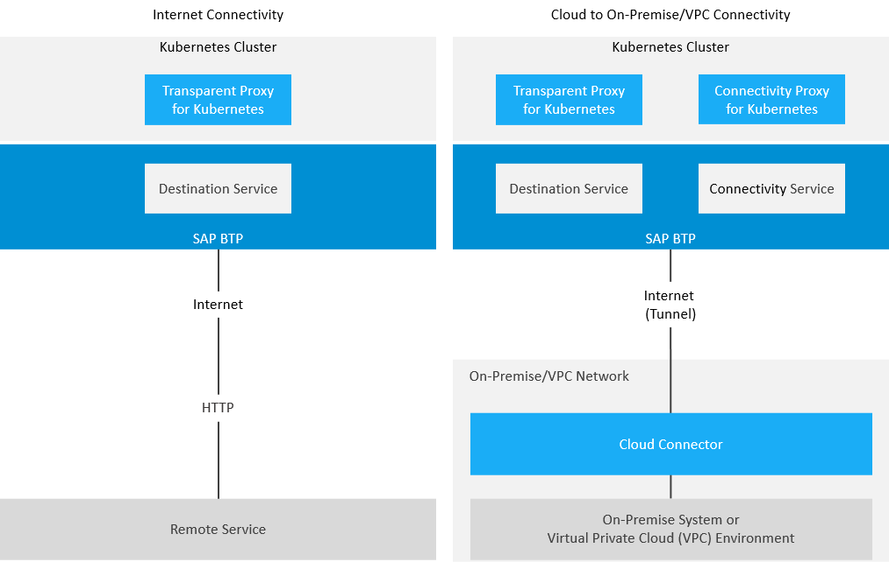

<!-- loioe54cc8fbbb571014beb5caaf6aa31280 -->

# What is SAP BTP Connectivity?

SAP BTP Connectivity: overview, features, restrictions.

> ### Note:  
> This documentation refers to SAP BTP, Multi-Cloud Foundation. If you are looking for information about the Neo environment, see [Connectivity for the Neo Environment](https://help.sap.com/viewer/b865ed651e414196b39f8922db2122c7/Cloud/en-US/5ceb84290d5644638f73d40fde3af5d0.html).
> 
> For more information on SAP BTP, Multi-Cloud Foundation, see also [What Is the Multi-Cloud Foundation?](https://help.sap.com/docs/btp/migrating-from-neo-environment-to-multi-cloud-foundation-cloud-foundry-and-kyma/what-is-multi-cloud-foundation?version=Cloud).

<a name="loioe54cc8fbbb571014beb5caaf6aa31280__content"/>

## Content

**In this Topic**

*Hover over the elements for a description. Click an element for more information.* 

**In this Guide**

*Hover over the elements for a description. Click an element for more information.*

<a name="loioe54cc8fbbb571014beb5caaf6aa31280__overview"/>

## Overview

SAP BTP Connectivity offers a set of services and software components which allow SAP cloud applications to securely access remote services that run on the Internet or on-premise. This framework:

-   Allows subaccount-specific configuration of application connections via destinations.
-   Allows you to make connections to on-premise systems, using the Cloud Connector.
-   Lets you establish a secure tunnel from your on-premise network to applications on SAP BTP, while you keep full control and auditability of what is exposed to the cloud.
-   Supports both the Neo environment and the Multi-Cloud Foundation for application development on SAP BTP.

> ### Note:  
> The on-premise use cases described in this guide are also applicable to virtual private cloud \(VPC\) environments.

-   For Internet communication, the Multi-Cloud Foundation provides the Destination service to establish a connection from your application to another remote service.
    -   The Transparent Proxy lets you connect workloads on a Kubernetes cluster.

-   To connect to an on-premsie system or service, you can additionally use the Connectivity service and the Connectivity Proxy \(for Kubernetes workloads\).
    -   On-premise scenarios also require the Cloud Connector, which is installed within your local network and routes the requests from and to SAP BTP.

-   For inbound connections \(calling an application or service on SAP BTP from an external source\), you can use Cloud Connector [service channels](using-service-channels-16f6342.md) \(on-premise connections\) or the respective API endpoints of your SAP BTP [region](https://help.sap.com/viewer/65de2977205c403bbc107264b8eccf4b/Cloud/en-US/350356d1dc314d3199dca15bd2ab9b0e.html "You can deploy applications in different regions. Each region represents a geographical location (for example, Europe, US East) where applications, data, or services are hosted.") :arrow_upper_right: \(Internet connections\).

For more information, see [Connectivity Scenarios](connectivity-scenarios-1e4b878.md).

Back to [Content](what-is-sap-btp-connectivity-e54cc8f.md#loioe54cc8fbbb571014beb5caaf6aa31280__content)

<a name="loioe54cc8fbbb571014beb5caaf6aa31280__environments"/>

## Environments

SAP BTP, Multi-Cloud Foundation covers three environments:

-   **Cloud Foundry**

    For more information, see [Getting Started in the Cloud Foundry Environment](https://help.sap.com/docs/btp/sap-business-technology-platform/getting-started-in-cloud-foundry-environment?version=Cloud).

-   **ABAP**

    For more information, see [Getting Started in the ABAP Environment](https://help.sap.com/docs/btp/sap-business-technology-platform/getting-started-in-abap-environment?version=Cloud).

-   **Kyma**

    For more information, see [Getting Started in the Kyma Environment](https://help.sap.com/docs/btp/sap-business-technology-platform/getting-started-in-kyma-environment?version=Cloud).

<a name="loioe54cc8fbbb571014beb5caaf6aa31280__components"/>

## Components

SAP BTP Connectivity provides the following services and components that you can use in different combinations to configure your specific connectivity scenario:

-   [Connectivity Service](connectivity-service-bd2d4f4.md)
-   [Destination Service](destination-service-8ff5483.md)
-   [Cloud Connector](cloud-connector-e6c7616.md)
-   [Connectivity Proxy](connectivity-proxy-for-kubernetes-e661713.md) \(for Kubernetes and SAP BTP, Kyma Environment\)
-   [Transparent Proxy](transparent-proxy-for-kubernetes-acc64ad.md) \(for Kubernetes and SAP BTP, Kyma Environment\)

For more information, see [Getting Started](getting-started-daca64d.md).

<a name="loioe54cc8fbbb571014beb5caaf6aa31280__onPremise"/>

## On-Premise Connectivity

> ### Note:  
> The on-premise use cases described in this guide are also applicable to virtual private cloud \(VPC\) environments.

A typical scenario for connecting your on-premise network to SAP BTP looks like this:

-   Your company owns a global account on SAP BTP and one or more subaccounts that are assigned to this global account.
-   Using SAP BTP, you subscribe to or deploy your own applications.
-   To connect to these applications from your on-premise network, the Cloud Connector administrator sets up a secure tunnel to your company's subaccount on SAP BTP.
-   The platform ensures that the tunnel can only be used by applications that are assigned to your subaccount.
-   Applications assigned to other \(sub\)accounts cannot access the tunnel. It is encrypted via transport layer security \(TLS\), which guarantees connection privacy.

For more information, see [Connectivity Scenarios](connectivity-scenarios-1e4b878.md).

<a name="loioe54cc8fbbb571014beb5caaf6aa31280__kubernetes"/>

## Connectivity for Kubernetes

You can use dedicated components to connect Kubernetes workloads to remote systems on the Internet or on-premise.

-   The Transparent Proxy lets you connect your Kubernetes workloads to remote systems using SAP BTP destinations easily. It provides authentication, simplifies user propagation, automated Connectivity Proxy integration, and unified access to the destination target systems.
-   The Connectivity Proxy for Kubernetes connects workloads running on a Kubernetes cluster to on-premise systems, which are exposed via the Cloud Connector.

You can deploy the Transparent Proxy and the Connectivity Proxy either as standalone components, or as modules in SAP BTP, Kyma environment.

For more information, see:

-   [Connectivity Proxy for Kubernetes](connectivity-proxy-for-kubernetes-e661713.md)
-   [Transparent Proxy for Kubernetes](transparent-proxy-for-kubernetes-acc64ad.md)
-   [Connectivity in the Kyma Environment](connectivity-in-the-kyma-environment-7501fbc.md)
-   [Connectivity Scenarios](connectivity-scenarios-1e4b878.md)

<a name="loioe54cc8fbbb571014beb5caaf6aa31280__features"/>

## Supported Protocols

SAP BTP Connectivity supports the following protocols and scenarios:

<table>
<tr>
<th valign="top">

Protocol

</th>
<th valign="top">

Scenario

</th>
</tr>
<tr>
<td valign="top">

**HTTP\(S\)** 

</td>
<td valign="top">

Exchange data between your cloud application and Internet services or on-premise systems.

-   Create and configure HTTP destinations to make Web connections.
-   Connect to on-premise systems via HTTP, using the Cloud Connector.

</td>
</tr>
<tr>
<td valign="top">

**RFC**

</td>
<td valign="top">

Invoke on-premise ABAP function modules via RFC.

-   Create and configure RFC destinations.
-   Make connections to back-end systems via RFC, using the Cloud Connector.

</td>
</tr>
<tr>
<td valign="top">

**TCP**

</td>
<td valign="top">

Access Internet or on-premise systems, generically on TCP level.

</td>
</tr>
<tr>
<td valign="top">

**LDAP**

</td>
<td valign="top">

Enables LDAP-based user management if you are operating an LDAP server within your network.

</td>
</tr>
<tr>
<td valign="top">

**Mail Protocols**

</td>
<td valign="top">

The e-mail provider and e-mail account are configured using MAIL destinations.

-   The **SMTP** protocol allows you to send e-mail messages from your Web applications using e-mail providers that are accessible on the Internet, such as Google Mail \(Gmail\).
-   The **IMAP** and **POP3** protocols let you retrieve e-mails from the mailbox of your e-mail account.

</td>
</tr>
</table>

Back to [Content](what-is-sap-btp-connectivity-e54cc8f.md#loioe54cc8fbbb571014beb5caaf6aa31280__content)

<a name="loioe54cc8fbbb571014beb5caaf6aa31280__restrictions"/>

## Restrictions

[General](what-is-sap-btp-connectivity-e54cc8f.md#loioe54cc8fbbb571014beb5caaf6aa31280__cf_neo)

[Protocols](what-is-sap-btp-connectivity-e54cc8f.md#loioe54cc8fbbb571014beb5caaf6aa31280__protocols)

[Multi-Cloud Foundation](what-is-sap-btp-connectivity-e54cc8f.md#loioe54cc8fbbb571014beb5caaf6aa31280__cf)

[Cloud Connector](what-is-sap-btp-connectivity-e54cc8f.md#loioe54cc8fbbb571014beb5caaf6aa31280__scc)

> ### Note:  
> For information about general SAP BTP restrictions, see [Prerequisites and Restrictions](https://help.sap.com/viewer/65de2977205c403bbc107264b8eccf4b/Cloud/en-US/e6ddaefcbb571014b70fa01fc6a3f818.html "Find a list of the product prerequisites and restrictions for SAP BTP.") :arrow_upper_right:.

**General**

<table>
<tr>
<th valign="top">

Topic

</th>
<th valign="top">

Restriction

</th>
</tr>
<tr>
<td valign="top">

**Java Connector for RFC**

</td>
<td valign="top">

To develop a Java Connector \(JCo\) application for RFC communication, your SDK local runtime must be hosted by a 64-bit JVM, on a x86\_64 operating system \(Microsoft Windows OS, Linux OS, or Mac OS X\).

On Windows platforms, you must install the **Microsoft Visual Studio C++ 2013** runtime libraries \(vcredist\_x64.exe\), see [Visual C++ Redistributable Packages for Visual Studio 2013](https://www.microsoft.com/en-us/download/details.aspx?id=40784).

</td>
</tr>
<tr>
<td valign="top">

**Ports**

</td>
<td valign="top">

For Internet connections, you are allowed to use any port \>`1024`. For cloud to on-premise scenarios, there are no port limitations.

</td>
</tr>
<tr>
<td valign="top">

**Destination Configuration** 

</td>
<td valign="top">

You can use destination configuration files with extension `.props`, `.properties`, `.jks`, and `.txt`, as well as files with no extension.

</td>
</tr>
</table>

Back to [Restrictions](what-is-sap-btp-connectivity-e54cc8f.md#loioe54cc8fbbb571014beb5caaf6aa31280__restrictions)

**Protocols**

For the cloud to on-premise connectivity scenario, the following protocols are currently supported:

<table>
<tr>
<th valign="top">

Protocol

</th>
<th valign="top">

Info

</th>
</tr>
<tr>
<td valign="top">

**HTTP**

</td>
<td valign="top">

HTTPS is not needed, since the tunnel used by the Cloud Connector is TLS-encrypted.

</td>
</tr>
<tr>
<td valign="top">

**RFC** 

</td>
<td valign="top">

You can communicate with SAP systems down to SAP R/3 release 4.6C. Supported runtime environment is SAP Java Buildpack with a minimal version of 1.8.0.

</td>
</tr>
<tr>
<td valign="top">

**LDAP**

</td>
<td valign="top">

 

</td>
</tr>
<tr>
<td valign="top">

**TCP** 

</td>
<td valign="top">

You can use TCP-based communication for any client that supports TCP.

</td>
</tr>
</table>

Back to [Restrictions](what-is-sap-btp-connectivity-e54cc8f.md#loioe54cc8fbbb571014beb5caaf6aa31280__restrictions)

**Multi-Cloud Foundation**

<table>
<tr>
<th valign="top">

Topic

</th>
<th valign="top">

Restriction

</th>
</tr>
<tr>
<td valign="top">

**Service Channels**

</td>
<td valign="top">

Service channels are supported only for RFC and for Kubernetes clusters.

The service channel for Kubernetes uses TCP, which enables a variety of protocol-specific connections.

For information, see [Using Service Channels](using-service-channels-16f6342.md).

</td>
</tr>
</table>

Back to [Restrictions](what-is-sap-btp-connectivity-e54cc8f.md#loioe54cc8fbbb571014beb5caaf6aa31280__restrictions)

**Cloud Connector**

<table>
<tr>
<th valign="top">

Topic

</th>
<th valign="top">

Restriction

</th>
</tr>
<tr>
<td valign="top">

**Scenarios**

</td>
<td valign="top">

To learn in which system landscapes you can set up the Cloud Connector, see [Extended Scenarios](cloud-connector-e6c7616.md#loioe6c7616abb5710148cfcf3e75d96d596__extended).

</td>
</tr>
<tr>
<td valign="top">

**Installation**

</td>
<td valign="top">

To check all software and hardware restrictions for working with the Cloud Connector, see [Prerequisites](prerequisites-e23f776.md).

</td>
</tr>
</table>

Back to [Restrictions](what-is-sap-btp-connectivity-e54cc8f.md#loioe54cc8fbbb571014beb5caaf6aa31280__restrictions)

Back to [Content](what-is-sap-btp-connectivity-e54cc8f.md#loioe54cc8fbbb571014beb5caaf6aa31280__content)

**Related Information**  

[Connectivity for the Multi-Cloud Foundation](connectivity-for-the-multi-cloud-foundation-34010ac.md "Consuming SAP BTP Connectivity for your application in the Multi-Cloud Foundation: Overview.")

[Connectivity Service](connectivity-service-bd2d4f4.md "Learn how to manage and consume the Connectivity service in SAP BTP, Multi-Cloud Foundation.")

[Destination Service](destination-service-8ff5483.md "Learn how to manage destinations and consume the Destination service in SAP BTP, Multi-Cloud Foundation.")

[Cloud Connector](cloud-connector-e6c7616.md "Learn more about the Cloud Connector: features, scenarios and setup.")

[Connectivity Proxy for Kubernetes](connectivity-proxy-for-kubernetes-e661713.md "Use the Connectivity Proxy for Kubernetes to connect workloads on a Kubernetes cluster to on-premise systems.")

[Transparent Proxy for Kubernetes](transparent-proxy-for-kubernetes-acc64ad.md "Use the Transparent Proxy for Kubernetes to connect workloads on a Kubernetes cluster to Internet and on-premise applications.")

[Connectivity via Reverse Proxy](connectivity-via-reverse-proxy-dde01af.md "The text discusses the use of a reverse proxy as an alternative approach to connect on-premise services to SAP BTP. While it allows for reuse of existing network infrastructure, it exposes services to potential attacks and requires significant involvement from your IT department. The Cloud Connector is recommended as a more secure and efficient solution, providing TLS tunneling and fine-grained access control.")

[Connectivity Support](connectivity-support-e5580c5.md "Support information for SAP BTP Connectivity and the Cloud Connector.")

